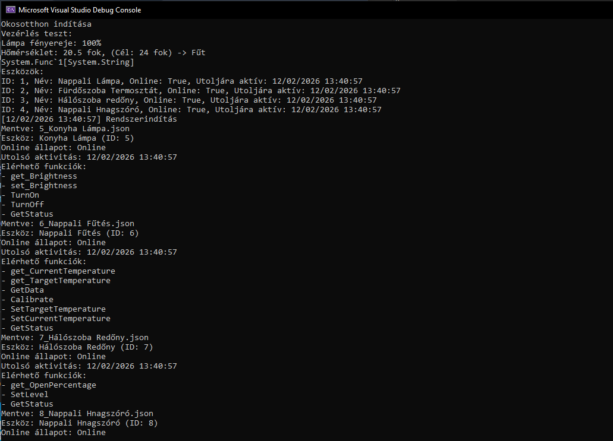

# Smart Home System Simulation

A console-based IoT device management system developed in C# (.NET 8.0). This project demonstrates object-oriented design patterns, custom file-based data persistence, and automated unit testing.

## Technical Highlights

* **Architecture:** Object-Oriented Design (Inheritance, Polymorphism) with Interface segregation (`ISwitchable`, `ISensor`) and Composition.
* **Advanced C# Features:**
    * **Reflection:** Runtime type and method inspection.
    * **Attributes:** Custom `[DeviceCategory]` attribute for metadata tagging.
    * **Delegates & Events:** Multicast delegate-based logging system (Console + File I/O).
* **Data Persistence:** Custom file database implementation using `System.IO` (Directory/File handling) and `System.Text.Json` serialization.
* **Algorithms:** LINQ for data filtering and aggregation.
* **Testing:** Comprehensive NUnit test project covering boundary analysis, exception handling, and state logic.

## Project Structure

* `SmartHome`: Main application containing the Device Manager, Data Layer, and Business Logic.
* `SmartHome.Tests`: NUnit test project.

## Requirements

* .NET 8.0 SDK
* Visual Studio 2022 (recommended) or VS Code